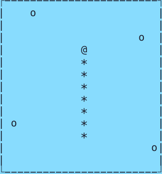

# cnake

Termnial snake written for learning purposes.
- C99
- Uses ncurses for rendering
- Uses my custom memory allocator [hisho](https://github.com/SourenP/hisho)




## Build and Run

```bash
make
./cnake
make clean
```

## Debug

```bash
make
ASAN_OPTIONS=detect_leaks=1 ./cnake 2> err
cat err
make clean
```

## Resources

- [fundamelon: terminal-game-tutorial](https://github.com/fundamelon/terminal-game-tutorial)
- [IC210: Keep it classy (or structy?) — a little fun with curses](https://www.usna.edu/Users/cs/wcbrown/courses/F16IC210/lab/l11/lab.html)

## Todo

- [X] Draw
  - [X] Grid
  - [X] Snake
    - [X] Head
    - [X] Body
    - [X] Food
  - [X] Food
  - [X] Game over
  - [X] Score
- [X] Move snake
  - [X] Head
  - [X] Body
- [X] Collision
  - [X] Snake x Bounds
  - [X] Snake x Snake
  - [X] Snake x Food
- [X] Spawn food
- [X] Use custom memory allocator
